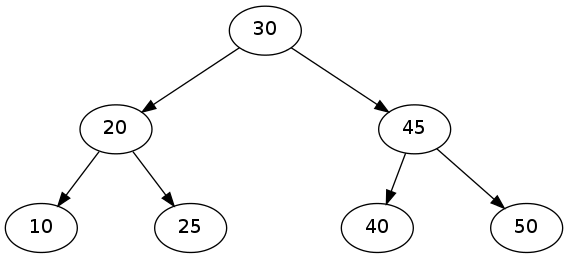

# Используем graphviz для визуализации дерева

## Что такое graphviz?

Это инструмент для визуализации графов, с помощью которого можно достаточно легко изобразить любые структуры данных. Например, бинарное дерево



## Зачем оно нужно?

Часто поиск ошибки глазами удобнее, быстрее и надежнее любого другого способа. Особенно в случаях, когда структура данных имеет некоторое графическое представление

## Что делать?

Графы в graphviz описываются в текстовых файлах на языке `dot`. Вот пример:
```
digraph G {
	A [ label="hello" ];
	B [ label="world" ];
	A -> B;
}
```

Из такого описания получается изображение:


В языке `dot` существует два главных типа записей. Первый тип записи описывает вершину и её свойства: надпись, цвет, форму и т.д.

```
_имя_вершины_ [ свойства_вершины ];
```

Второй тип записей задаёт рёбра в графе:

```
_имя_вершины_1_ -> _имя_вершины_2_;
```

Чтобы преобразовать файл в `.png` картинку, нужно написать в терминале

```bash
dot example.dot -Tpng -o example.png
```

## Что дальше?

Больше про graphviz можно прочитать [здесь](./dotguide.pdf)
